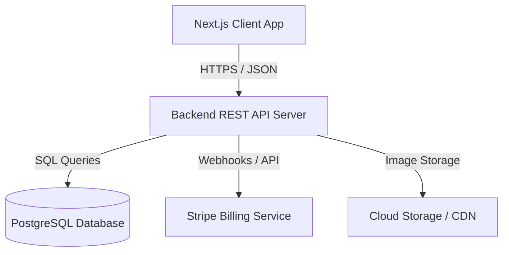
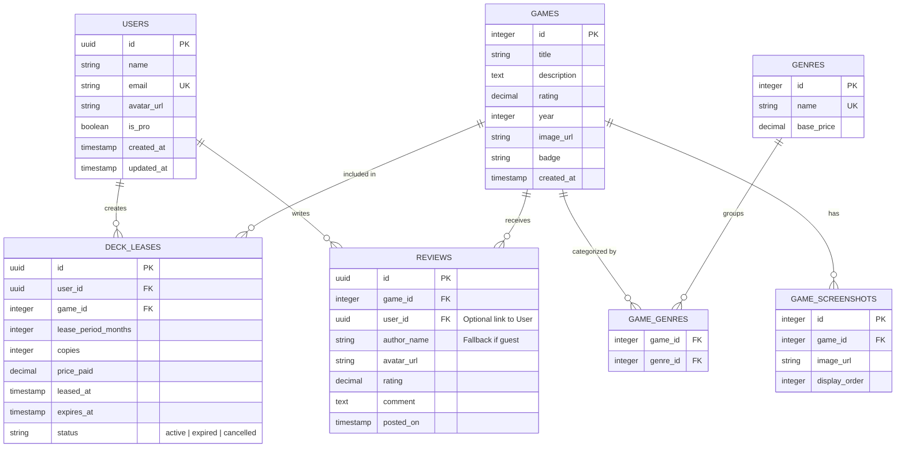

# Backend System & Database Requirements

This document outlines the complete backend architecture, database models, business logic formulas, and REST API requirements necessary to migrate the Crosshoc game discovery and catalog web application from static mock data (`constants/`) to a production-ready, database-backed dynamic system.

---

## 1. System Architecture

The following diagram illustrates the relationship between the client application and the target backend service:



---

## 2. Database Models (ERD & Data Schema)

To support the current features of Crosshoc (game catalog, dynamic deck leasing, reviews, and user accounts), the following relational database schema is required. We recommend **PostgreSQL** or a similar relational database.

### Entity Relationship Diagram (ERD)



### Table Definitions & Field Requirements

#### `users`

Tracks user accounts, profile details, and tier status.

- `id` (UUID, Primary Key): Unique user identifier.
- `name` (VARCHAR, Not Null): Profile display name.
- `email` (VARCHAR, Unique, Not Null, Index): Account email.
- `avatar_url` (VARCHAR, Nullable): URL to user profile picture.
- `is_pro` (BOOLEAN, Default: `false`): Premium billing status (linked to "Upgrade to Pro" action).
- `created_at` (TIMESTAMP, Default: `NOW()`)
- `updated_at` (TIMESTAMP, Default: `NOW()`)

#### `genres`

Stores game genres and their associated baseline leasing prices.

- `id` (SERIAL, Primary Key)
- `name` (VARCHAR, Unique, Not Null): E.g., `Action`, `Strategy`, `RPG`, `Shooter`, `Adventure`, `Puzzle`, `Racing`, `Sports`, `Simulation`, `Casual`, `Indie`, `Platformer`, `Arcade`.
- `base_price` (DECIMAL(10, 2), Not Null): Baseline price for leasing (e.g., RPG is `69.00`, Action is `59.00`).

#### `games`

Core catalog table for games.

- `id` (SERIAL, Primary Key): Unique game catalog identifier.
- `title` (VARCHAR, Not Null, Index): Title of the game.
- `description` (TEXT, Not Null): General game description.
- `rating` (DECIMAL(3, 1), Default: `0.0`): Overall rating (1.0 to 10.0 scale).
- `year` (INTEGER, Not Null): Release year of the game.
- `image_url` (VARCHAR, Not Null): Main capsule/cover art URL.
- `badge` (VARCHAR, Nullable): UI indicator enum (`"New"`, `"Top Rated"`, `"Trending"`, `"Editor's Pick"`).
- `created_at` (TIMESTAMP, Default: `NOW()`)

#### `game_screenshots`

Stores additional screenshot assets per game.

- `id` (SERIAL, Primary Key)
- `game_id` (INTEGER, Foreign Key referencing `games.id`, On Delete Cascade)
- `image_url` (VARCHAR, Not Null): Screenshot URL.
- `display_order` (INTEGER, Default: `0`): Ordering sequence for galleries.

#### `game_genres`

Many-to-many lookup table linking games to one or more genres.

- `game_id` (INTEGER, Foreign Key referencing `games.id`, On Delete Cascade)
- `genre_id` (INTEGER, Foreign Key referencing `genres.id`, On Delete Cascade)
- _Composite Primary Key_: `(game_id, genre_id)`

#### `reviews`

User/player reviews for individual games.

- `id` (UUID, Primary Key)
- `game_id` (INTEGER, Foreign Key referencing `games.id`, On Delete Cascade)
- `user_id` (UUID, Foreign Key referencing `users.id`, Nullable): Linked if reviewer is a registered member.
- `author_name` (VARCHAR, Not Null): Author's visible name (from user account or fallback).
- `avatar_url` (VARCHAR, Nullable): Author's avatar URL.
- `rating` (DECIMAL(3, 1), Not Null): Review rating (1.0 to 10.0).
- `comment` (TEXT, Not Null): Written feedback.
- `posted_on` (TIMESTAMP, Default: `NOW()`): Date/time posted.

#### `deck_leases`

Stores game leases (copies, periods, pricing) added to user decks.

- `id` (UUID, Primary Key)
- `user_id` (UUID, Foreign Key referencing `users.id`, On Delete Cascade)
- `game_id` (INTEGER, Foreign Key referencing `games.id`)
- `lease_period_months` (INTEGER, Not Null): Must be `1`, `3`, `6`, or `12`.
- `copies` (INTEGER, Not Null): Must be between `1` and `9`.
- `price_paid` (DECIMAL(10, 2), Not Null): Total locked price computed at transaction time.
- `leased_at` (TIMESTAMP, Default: `NOW()`)
- `expires_at` (TIMESTAMP, Not Null): Calculated based on `lease_period_months`.
- `status` (VARCHAR, Default: `'active'`): Enum `'active'`, `'expired'`, `'cancelled'`.

---

## 3. Business Logic & Computations

The backend must replicate the dynamic calculations currently handled client-side to ensure security, persistence, and auditability.

### A. Monthly Base Pricing Calculation

The system calculates a game's baseline monthly price dynamically, adjusting for release year (recency) and internal ID parity:

$$\text{Monthly Base Price} = \max\left(12,\; \lfloor (\text{BasePriceByGenre} + \text{RecencyAdjustment} + \text{ParityAdjustment}) \times 0.35 \rfloor\right)$$

- **BasePriceByGenre**: The price configured on the primary genre of the game:
  | Genre                   | Base Price ($) |
  | ----------------------- | -------------- |
  | RPG                     | 69             |
  | Action, Shooter, Sports | 59             |
  | Racing                  | 54             |
  | Strategy, Simulation    | 49             |
  | Adventure               | 44             |
  | Platformer              | 39             |
  | Puzzle, Arcade          | 29             |
  | Indie                   | 24             |
  | Casual                  | 19             |
- **RecencyAdjustment**:
  - If release year is current year (e.g. `2025`/`2026`), adjustment is `$0`.
  - Otherwise, adjustment is `-$8`.
- **ParityAdjustment**:
  - If `game.id % 2 === 0`, adjustment is `+$2`.
  - Otherwise, adjustment is `$0`.

> [!NOTE]
> The absolute minimum monthly base price returned by the formula is **$12**.

---

### B. Lease Period Discounts & Estimations

When a user selects a leasing duration for a game, a bulk discount is applied to the aggregate cost:

- **1 Month**: No discount (multiplier = `1.0`)
- **3 Months**: 5% discount (multiplier = `0.95`)
- **6 Months**: 10% discount (multiplier = `0.90`)
- **12 Months**: 15% discount (multiplier = `0.85`)

**Calculation steps for lease duration:**

1. $\text{Monthly Price} = \text{Monthly Base Price (computed above)}$
2. $\text{Discounted Total} = \text{Monthly Price} \times \text{Lease Period (Months)} \times \text{Discount Multiplier}$
3. $\text{Unit Price} = \max(12,\; \text{round}(\text{Discounted Total}))$
4. $\text{Estimated Total Cost} = \text{Unit Price} \times \text{Copies}$

---

### C. Recommendation Engine Algorithm

On the game details screen, the backend must recommend a similar game for the user.

1. Find all games in the catalog except the currently selected game.
2. Filter for games that share **at least one genre** with the current game.
3. Sort these candidates by **rating descending**, selecting the highest-rated game.
4. **Fallback:** If no candidate share any genres, sort _all other games_ by rating descending and return the top-rated game.

---

### D. Sorting, Querying, & Pagination Logic

The core catalog page displays games according to specific filtering, categorization, and sorting logic:

#### Content Sections (`section`)

- **`all`**: Returns all games.
- **`new`**: Returns only games with a badge of `'New'`.
- **`top`**: Returns games sorted by `rating DESC` and limits the result to the **top 8** games.
- **`genres`**: Groups/orders games primary genre alphabetically.

#### Sort Modes (`sort`)

- **`relevance`**: Standard ordering. If `section=genres`, sorts by primary genre name alphabetically. Otherwise, retains catalog order (defaulting to the deterministic shuffle list).
- **`date-added`**: Sorts games by `id DESC` (or creation timestamp descending).
- **`name`**: Sorts alphabetically by `title ASC`.
- **`release-date`**: Sorts by release `year DESC`.
- **`popularity`**: Sorts using a weighted badge value, with `rating DESC` as a tie-breaker.
  $$ \text{Badge Weight} = \begin{cases}
  4 & \text{if badge is 'Trending'} \\
  3 & \text{if badge is 'Top Rated'} \\
  2 & \text{if badge is 'Editor's Pick'} \\
  1 & \text{if badge is 'New'} \\
  0 & \text{otherwise}
  \end{cases}$$
  $$
- **`average-rating`**: Sorts by `rating DESC`.

> [!TIP]
> **Deterministic Catalog Ordering (Shuffle):** The current frontend uses a pseudo-shuffle algorithm to prevent games from defaulting directly to insertion order: `((id * 37) % 101)`. The backend could optionally support a seed-based or query-layer equivalent shuffle for consistent paginated listings.

---

## 4. API Endpoints Specification

### Authentication & Profile

#### `POST /api/auth/login`

Authenticates a user and establishes a session cookie or token.

- **Request Body:**
  ```json
  {
    "email": "m@example.com",
    "password": "user-password"
  }
  ```
- **Response (200 OK):**
  ```json
  {
    "token": "jwt-session-token",
    "user": {
      "id": "e932b53e-0c15-4fae-9d95-885f624f84b7",
      "name": "shadcn",
      "email": "m@example.com",
      "avatar": "https://picsum.photos/seed/crosshoc-user/64/64",
      "is_pro": false
    }
  }
  ```

#### `GET /api/auth/me`

Retrieves authenticated user profile information.

- **Headers:** `Authorization: Bearer <token>`
- **Response (200 OK):** Same user object structure as above.

---

### Game Catalog APIs

#### `GET /api/games`

Fetch a filtered, sorted list of games.

- **Query Parameters:**
  - `section` (Optional): `all`, `new`, `top`, `genres`
  - `genre` (Optional): E.g., `Action`, `Strategy`, `RPG`, etc.
  - `sort` (Optional): `relevance`, `date-added`, `name`, `release-date`, `popularity`, `average-rating`
  - `limit` (Optional, default 20)
  - `page` (Optional, default 1)
- **Response (200 OK):**
  ```json
  {
    "games": [
      {
        "id": 1,
        "title": "No Case Should Remain Unsolved",
        "genres": ["Adventure", "Puzzle"],
        "rating": 9.7,
        "year": 2024,
        "image": "https://media.rawg.io/media/screenshots/766/76669775675948b1eb3f3eb1c1dfc7dc.jpg",
        "badge": "Top Rated",
        "description": "An immersive adventure filled with exploration and discovery.",
        "monthly_base_price": 12.0
      }
    ],
    "pagination": {
      "total": 36,
      "page": 1,
      "limit": 20,
      "pages": 2
    }
  }
  ```

#### `GET /api/games/:id`

Retrieves comprehensive details for a specific game, including screenshots, reviews, and a recommended similar game.

- **Response (200 OK):**
  ```json
  {
    "game": {
      "id": 1,
      "title": "No Case Should Remain Unsolved",
      "genres": ["Adventure", "Puzzle"],
      "rating": 9.7,
      "year": 2024,
      "image": "https://media.rawg.io/media/screenshots/766/76669775675948b1eb3f3eb1c1dfc7dc.jpg",
      "screenshots": [
        "https://media.rawg.io/media/screenshots/7ce/7ce309d2d08fd171275b934bd391c1e3.jpg",
        "https://media.rawg.io/media/screenshots/6fa/6fa6431675fefe340c2ca30f109ca065.jpg"
      ],
      "badge": "Top Rated",
      "description": "An immersive adventure filled with exploration and discovery.",
      "monthly_base_price": 12.0
    },
    "recommendation": {
      "id": 5,
      "title": "Red Matter 2",
      "genres": ["Adventure", "Puzzle"],
      "rating": 9.3,
      "description": "Fast-paced action with intense combat and thrilling gameplay."
    }
  }
  ```

---

### Reviews APIs

#### `GET /api/games/:id/reviews`

Get user reviews for a game.

- **Response (200 OK):**
  ```json
  {
    "reviews": [
      {
        "id": "1-1",
        "author": "Alex",
        "avatar": "https://picsum.photos/seed/reviewer-alex/64/64",
        "rating": 9.7,
        "postedOn": "2026-05-12",
        "comment": "Great lease value for the quality. Performance stayed stable even in longer sessions."
      }
    ]
  }
  ```

#### `POST /api/games/:id/reviews`

Allows authenticated users to post a review.

- **Headers:** `Authorization: Bearer <token>`
- **Request Body:**
  ```json
  {
    "rating": 9.5,
    "comment": "Incredible gameplay and graphics!"
  }
  ```
- **Response (201 Created):**
  ```json
  {
    "success": true,
    "review": {
      "id": "7a3536eb-f6ff-4cb9-9943-2fcf675cd3e1",
      "game_id": 1,
      "author": "shadcn",
      "avatar": "https://picsum.photos/seed/crosshoc-user/64/64",
      "rating": 9.5,
      "postedOn": "2026-06-16",
      "comment": "Incredible gameplay and graphics!"
    }
  }
  ```

---

### Deck & Lease APIs

#### `GET /api/deck`

Retrieve the active user's deck leases.

- **Headers:** `Authorization: Bearer <token>`
- **Response (200 OK):**
  ```json
  {
    "deck": [
      {
        "lease_id": "3b29cda5-6712-4ee1-b993-9c882a1738e4",
        "game": {
          "id": 1,
          "title": "No Case Should Remain Unsolved",
          "image": "https://media.rawg.io/media/screenshots/766/76669775675948b1eb3f3eb1c1dfc7dc.jpg"
        },
        "lease_period_months": 3,
        "copies": 2,
        "price_paid": 48.0,
        "leased_at": "2026-06-16T13:22:23.000Z",
        "expires_at": "2026-09-16T13:22:23.000Z",
        "status": "active"
      }
    ]
  }
  ```

#### `POST /api/deck`

Leases a game and adds it to the user's active Deck.

- **Headers:** `Authorization: Bearer <token>`
- **Request Body:**
  ```json
  {
    "gameId": 1,
    "leasePeriod": 3,
    "copies": 1
  }
  ```
- **Response (201 Created):**
  ```json
  {
    "success": true,
    "lease_id": "3b29cda5-6712-4ee1-b993-9c882a1738e4",
    "total_price": 24.0,
    "message": "Added to Deck successfully."
  }
  ```

---

## 5. Security & Validation Rules

1. **Copies Validation:**
   - The backend must enforce: `1 <= copies <= 9`. Rejects any payload with copies outside this range with a `400 Bad Request`.
2. **Lease Period Validation:**
   - Only allow lease periods of `1`, `3`, `6`, and `12` months. Rejects any other value.
3. **Billing Integrity:**
   - Do **NOT** rely on price calculations sent from the client. Re-compute the transaction cost on the server at request time using the current genre base price and adjustments.
4. **Authentication Middleware:**
   - All `/api/deck/*` routes must be guarded by authentication middleware that checks authorization headers.
